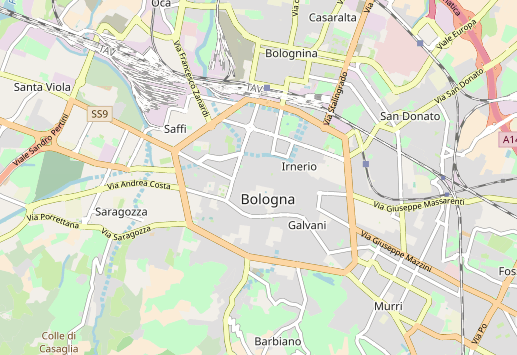

# OSM Bright styles
## Introduction
This is a GeoServer data directory with OSM layer and styles mimicking a OSM-bright style.



Live example [here](https://dev.mapstore.geo-solutions.it/mapstore/#/viewer/openlayers/8444)


## Getting started

The data directory is meant to work as follows: 


Thus, in order to use this data directory, one would need to:

* Have a Linux machine handy (GeoServer can run on whatever operating system, but Imposm requires Linux)
* Setup a GeoServer with the necessary extensions
* Download a GeoPackage with low resolution information
* Setup a OSM PostGIS database using Imposm
* Parametrize the GeoServer with the database access information.

Every step is explained below.

### GeoServer

In order to use this data directory a GeoServer 2.16 or newer is recommended.
In addition, the following plugins need to be included:

* The [GeoServer CSS extension](https://docs.geoserver.org/latest/en/user/styling/css/install.html), 
  to parse and use the styles included in this data directory. 
* The [Pregeneralized Features extension](https://docs.geoserver.org/stable/en/user/data/vector/featurepregen.html), 
  used to access simplified overview tables of layers that are particularly big, and only partially displayed at lower zoom levels.

### The low resolution GeoPackage

For world-wide views the map does not show the accurate OSM data, but a set of simplified layers
that are meant to be viewed at low zoom levels.
 
These layers have been collected in a (large) GeoPackage for your convenience:

* [Download the data](https://www.dropbox.com/s/oannhf1cf7n1g89/osm-lowres.gpkg?dl=1)
* Place the GeoPackage in the ``data`` folder of the data directory:

```
  osm-styles
  +---data
      +---keepme.txt
      +---osm-lowres.gpkg 
```  

The data directory is already configured to lookup the GeoPackage from this location.

### The OSM PostGIS database

The large part of the data comes from OpenStreetMap. The import process can be very long for large
areas, it is recommended to start with a small country to practice the process, before moving to larger imports.

To provide a reference, on a Ryzen 1700x with local SSD (Samsung EVO 960) and 32GB of memory,
on a Linux Mint 19.2 with stock PostgreSQL 9.5.4 and PostGIS 2.21, importing the full Europe OpenStreeMap dataset required:

* 250GB of disk space (allocated fully on SSD), split between 22.5GB of OSM PBF file, 45GB of Imposm working cache,
  and over 130GB of resulting PostgreSQL database (the Imposm cache can be removed at the end of the process) 
* 4 hours of processing 

Also, the tool used to parse, reclassify and import the data into PostgreSQL, called ``imposm``, **works only on Linux**. We have prepared a [command line tool](imposm/README.md) that can be run on Linux to prepare a PostgreSQL database dump, which can then be moved to a Windows machine and restored.

With this in mind:

1. Download a [Imposm binary](https://imposm.org/docs/imposm3/latest/install.html) as linked from the [documentation site](https://imposm.org/docs/imposm3/latest/index.html)
2. Download the preferred OSM extract from the [Geofabrik download server](https://download.geofabrik.de/), in ``pbf`` format.
3. Get into into the ``imposm`` folder of the data directory, and perform the "read" portion of the import (replace the ``$IMPOSM_DIR`` and ``$OSM_PBF_DUMP`` with the actual values from your machine):

    ``$IMPOSM_DIR/imposm import -mapping mapping.yml -read $OSM_PBF_DUMP
`` 

4. Run the "write" part of the import process (replace the ``$user``, ``$password``, ``$host`` and ``$database`` with actual values for your database). The ``optimize`` parameter includes a long process of table clustering for optimal serve performance, it's not mandatory and can take a lot of time. 

    ``$IMPOSM_DIR/imposm import -mapping mapping.yml -write -connection postgis://$user:$password@$host/$database -overwritecache``
    
   It's possible to add a ``-optimize`` extra option at the end of the above command to have optimal record layout in the database. However, caution is recommended, that step can take much more time than importing the data itself.

5. Congratulations, you have succesfully imported the data in PostGIS

### Setting up the Noto Fonts

OSM data can have labels in many languages. The styles use the [Google Noto Fonts](https://www.google.com/get/noto/) to render them all in the various scripts. The Noto Fonts website allows you to download single fonts, or to download them all in a single large zip file (look for the "Download all fonts" link). 

The Noto web site has instructions on [how to install](https://www.google.com/get/noto/help/install/) the fonts for some common operating systems.
Specifically for **Windows**, make sure the fonts are installed for all users, it's possible to do by selecting the font file, right click, and then selecting "install for all users".
The Java runtime will not see the fonts installed for the current user alone.

Failing to install the fonts won't prevent the map from showing up, but will result in a fallback to be chosen instead.

### Parameterizing GeoServer and starting it up

The data directory contains paramers in place of database connection values for user, password, host and database. This is to make it easy to move it around, in different environment, without changing its contents.

You have two options:

1. Start GeoServer without any parametrization, find the ``osm`` store, and manually change user, password, host and database
2. Setup the necessary system variables to start up GeoServer in parametric mode.

If you decide to follow the second, make sure to pass the following to the command line starting up the Java virtual machine (e.g., ``startup.sh`` if running the GeoServer binary package, Tomcat own ``catalina.sh`` or ``JAVA_OPTS`` variable, and os on). Replace the variables to match your setup:

``POSTGRES_ENPOINT=127.0.0.1;POSTGRES_PORT=5432;POSTGRES_PASSWORD=$password;POSTGRES_USER=$user;OSM_DB=$database;OSM_SCHEMA=import`` 

### Found an issue? Contribute a fix!

If you find any issue with instructions or styling, pull requests with fixes and improvements are more than welcomed!

## License
This data directory is licensed as MIT, as per the [license](https://github.com/geosolutions-it/osm-styles/blob/master/LICENSE.md) file.

